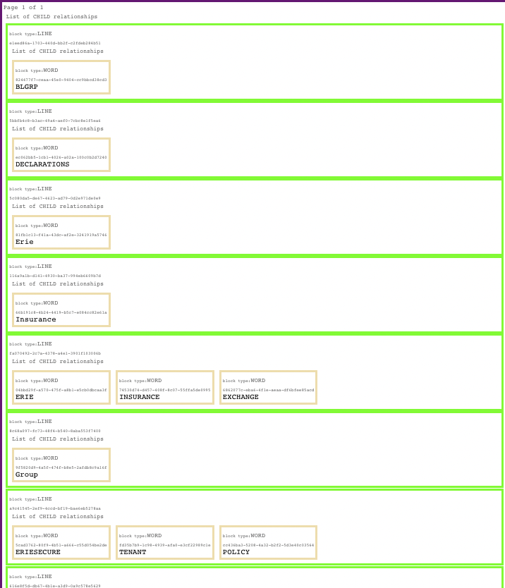

# textract-visualizer-plugin

This is a chrome browser plugin for redrawing raw textract output files as table data, within the browser window.

## Installation instructions

1. Check out this code locally
2. Navigate to `chrome://extensions/`
3. In the upper right, turn on Developer Mode
4. Click the button "Load Unpacked"
5. Select the directory containing this extension (the directory containing manifest.json)
6. There should now be a card on the extensions screen for Textract Visualizer
7. If you check out an updated version, or make any changes yourself, you will need to click the "refresh" icon on this card for the changes to take effect on the next page refresh.

Note, if you have the JSON Formatter extension installed, this plugin will still work in parallel - the table will render underneath the JSON tree (so scroll down or collapse the parent node).

## Functions

Renders the textract file as a color-coded table, e.g.:

Each line that contains a node id (like `e1eed86a-1703-440d-bb2f-c2fdeb284b51`) can be clicked on to copy the id to the clipboard.